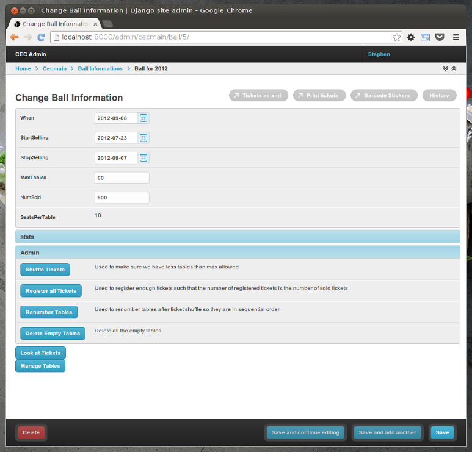
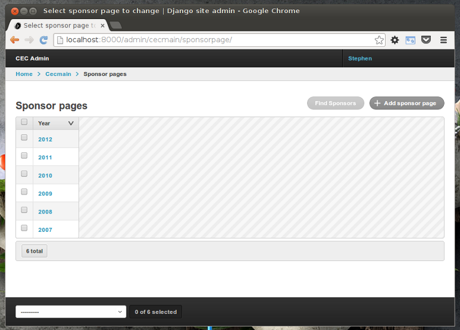

.. _admin_templates:

Admin Templates
===============

CWF supplies some templates to compliment the
:ref:`admin functionality <admin_index>`.

These are:

    :ref:`admin_template_blank`
        Renders a blank admin page with the breadcrumbs filled out

    :ref:`admin_template_changeform`
        Renders a model changeform with any buttons you've defined

    :ref:`admin_template_changelist`
        Renders a model changelist with any buttons you've defined

As long as you make the templates :ref:`available <template_availability>` then
the ``changelist`` and ``changeform`` templates will be used automatically
by the admin and the ``blank`` template is available for you
to use in any custom admin pages you create.

.. note:: These templates do assume you're using
  `grappelli <http://www.grappelliproject.com/>`_

.. _admin_template_blank:

admin/blank.html
----------------

This template is useful to extend from when you're returning a template for a
:ref:`button_view`. It provides an empty page with the breadcrumbs already
filled out with Home, the model, the instance of the model and the description
of the button as the last part.

It works by extending ``admin/base_site.html`` and using the following:

    ``app_label``
        Name of the current app

    ``module_name``
        The name of the model in the app that is being edited

    ``object``
        The object being edited

    ``bread_title``
        The name of the current page

As part of the ``base_site.html`` template it inherits from, you have the
``content`` block available to add information to the body of the page.

.. note:: If there is no object then it assumes you're url has one less part to
  it and will change the breadcrumb to only display Home, app, model, button.

.. _admin_template_changeform:

admin/change_form.html
----------------------

This is the form that is used by django admin to display the form when you are
adding or editing an instance of a model.

The CWF version of this template will display the buttons that have the
``for_all`` :ref:`option <button_options>` set to False.

Those buttons that don't save the template when they are clicked are displayed
at the top of the page and those that do save the form when they are clicked are
displayed at the bottom of the page. See :ref:`button_clicking` for more
information.

``ButtonGroups`` are displayed in a collapsible panel of rows where each row
has two columns: The button itself and it's description.

All buttons are displayed using the :ref:`button html <button_html>`.

For example, say we have the following button specification in our admin:

.. code-block:: python

    class BallAdmin(ButtonAdmin):
        [..]

        buttons = (
              Button("printxml", "Tickets as xml", need_super_user=False, new_window=True, save_on_click=False)
            , Button("printable", "Print tickets", need_super_user=False, new_window=True, save_on_click=False)
            , Button("barcodes", "Barcode Stickers", need_super_user=False, new_window=True, save_on_click=False)

            , ButtonGroup("Admin",
                ( Button('shuffletickets', "Shuffle Tickets", need_super_user=False, needs_auth='cecmain.admin_ball'
                    , description="Used to make sure we have less tables than max allowed"
                    )
                , Button('registerall', "Register all Tickets", need_super_user=False, needs_auth='cecmain.admin_ball'
                    , description="Used to register enough tickets such that the number of registered tickets is the number of sold tickets"
                    )
                , Button('renumber', "Renumber Tables", need_super_user=False, needs_auth='cecmain.admin_ball'
                    , description="Used to renumber tables after ticket shuffle so they are in sequential order"
                    )
                , Button('deleteempty', "Delete Empty Tables", need_super_user=False, needs_auth='cecmain.admin_ball'
                    , description="Delete all the empty tables"
                    )
                )
                , need_super_user=False, needs_auth='cecmain.admin_ball'
            )

            , Button('configure', "Configure Test Ball", new_window=True, need_super_user=False, needs_auth='cecmain.admin_ball'
                # Only show configure for test ball
                , condition = lambda button, ball : ball and ball.is_test_ball()
                )
            , Button('tickets', "Look at Tickets", need_super_user=False)
            , Button('manageTables', "Manage Tables", need_super_user=False)
            )

        [..]

We'll get a changeform that looks something like:

.. _admin_template_changelist:

admin/change_list.html
----------------------

This is the form that is used by django admin to display the list of instances
of a particular model.

The CWF version of this template will display the buttons that have the
``for_all`` :ref:`option <button_options>` set to True.

They are displayed at the top of the page and doesn't support button groups.

So say we had the following code in our admin:

.. code-block:: python

    class SponsorAdmin(ButtonAdmin):
        [..]

        buttons = (
              Button('findsponsors', "Find Sponsors", for_all=True)
            )

        [..]

We'll get a changelist that looks something like:

